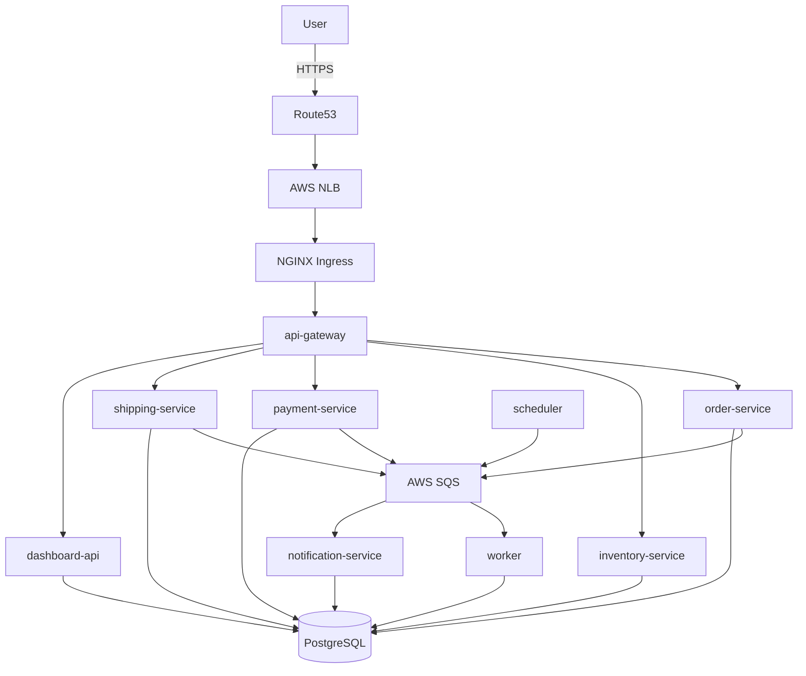

# Order Fulfillment Platform

Production-grade nine-service order fulfillment platform on Amazon EKS. Every architectural decision is documented with the alternative considered and why it was rejected.

**Live:** https://orders.hasanali.uk | **Grafana:** https://orders.hasanali.uk/grafana

---

## Services

| Service | Language | Port | Role |
|---|---|---|---|
| api-gateway | Python/FastAPI | 8000 | Auth, rate limiting, routing |
| order-service | Python/FastAPI | 8001 | Order lifecycle, state machine |
| inventory-service | Go | 8002 | Stock levels, reservations |
| payment-service | Python/FastAPI | 8003 | Payments, refunds, ledger |
| notification-service | Go | 8004 | Email/SMS via SQS |
| shipping-service | Python/FastAPI | 8005 | Shipments, tracking |
| worker | Go | 8006 | SQS consumer, cross-service events |
| scheduler | Go | 8007 | Cron — expirations, retries |
| dashboard-api | Python/FastAPI | 8009 | Admin UI, analytics |

---

## Architecture



---

## Quick Start

```bash
# Local
cp .env.example .env  # fill in values
docker compose up --build

# AWS
cd infra/bootstrap && terraform init && terraform apply
cd ../state/network && terraform init && terraform apply -auto-approve
cd ../cluster      && terraform init && terraform apply -auto-approve
cd ../addons       && terraform init && terraform apply -auto-approve
export DB_PASSWORD=x API_KEY=x GRAFANA_PASSWORD=x
./scripts/bootstrap.sh

# Tear down
./scripts/teardown.sh
```

---

## A. Cluster Topology

**Node group:** 4 × t3.small on-demand across eu-west-2a/b/c. t3.small chosen because it is Free Tier eligible on accounts created after July 2025. c7i-flex.large considered — more pods per node (29 vs 11) but higher hourly cost for a dev cluster.

**Karpenter:** Provisions overflow nodes dynamically. On-demand only — spot rejected because payment-service handles financial transactions and spot interruption mid-transaction requires complex retry logic.

**Stateful AZ strategy:** PostgreSQL and Redis use `WaitForFirstConsumer` StorageClass. EBS volumes bind to the AZ of the first scheduled pod. If that AZ fails, RTO is 15-30 minutes via snapshot restore. Production would use RDS Multi-AZ (sub-60s failover) — rejected here due to $100+/month cost.

---

## B. Delivery Pipeline

**Commit → traffic for payment-service:**
1. Push to `main` touching `services/payment-service/`
2. Path-filtered GitHub Actions triggers — only changed services build
3. Trivy scans image — blocks on HIGH/CRITICAL CVEs
4. cosign signs image — unsigned images rejected at admission
5. Image pushed to ECR with 7-char git SHA tag
6. Helm upgrade with new SHA — rolling update, readiness probe gates traffic
7. ArgoCD detects drift, self-heals if manual changes made

**Time push to traffic:** ~8 minutes. **Rollback:** `helm upgrade --set global.imageTag=<prev-sha>` — under 3 minutes.

**ArgoCD vs GitHub Actions:** GitHub Actions owns build/push/deploy. ArgoCD owns drift detection and self-healing. They don't overlap — Actions is the push mechanism, ArgoCD is the reconciler.

**GitHub Actions only considered** — rejected because it has no drift detection. A manual `kubectl` change would silently persist.

---

## C. Secrets Lifecycle

**Secret journey:** AWS Secrets Manager → External Secrets Operator (IRSA) → K8s Secret → pod env var.

**Rotation:** ESO polls Secrets Manager every hour. On rotation, ESO updates the K8s Secret. Pods don't restart automatically — `kubectl rollout restart` propagates new credentials with zero dropped requests (old pods drain before termination).

**ESO vs Secrets Store CSI:** ESO creates native K8s Secret objects — works with any existing tooling. CSI mounts secrets as files — all nine services would need code changes to read files instead of env vars. ESO is a drop-in replacement.

---

## D. Storage and Recovery

**PostgreSQL:** StatefulSet, 20Gi gp3 EBS, encrypted with customer-managed KMS key, `reclaimPolicy: Retain`.

**Redis:** StatefulSet, 10Gi gp3 EBS, AOF persistence (`appendfsync: everysec`).

**Snapshot and restore:**
```bash
./scripts/snapshot.sh               # takes EBS VolumeSnapshot
./scripts/restore.sh <snapshot-name> # restores to new PVC
```

**RTO:** 10 minutes. **RPO:** 24 hours (daily snapshots).

**Restore evidence (2026-05-17):**
21:26:24 — snapshot taken: postgres-snapshot-20260517212624
21:27:45 — postgres restored from snapshot
21:28:02 — verified: 12 tables, all order data intact

**RDS Multi-AZ considered** — automatic failover under 60s, RPO near-zero. Rejected — adds $100+/month. Acceptable trade-off for dev.

---

## E. Scaling

| Service | Min | Max | Metric | Notes |
|---|---|---|---|---|
| api-gateway | 1 | 5 | CPU 70% | Stateless proxy |
| order-service | 1 | 5 | CPU 70% | DB connection limit is real ceiling |
| inventory-service | 1 | 4 | CPU 70% | Read-heavy |
| payment-service | 1 | 5 | CPU 60% | Lower threshold — payment errors costly |
| notification-service | 1 | 3 | CPU 70% | Bounded by SQS queue depth |
| worker | 1 | 4 | CPU 70% | Scales with message rate |
| scheduler | 1 | 1 | N/A | Singleton — duplicate schedulers double-fire jobs |
| dashboard-api | 1 | 3 | CPU 70% | Read-only |

**First to break under load:** order-service — PostgreSQL connection exhaustion before CPU saturation. Fix: PgBouncer connection pooler. Default max_connections=100 is hit before HPA triggers.

**Karpenter consolidation:** `WhenEmptyOrUnderutilized`, consolidates after 1 minute. Empty nodes terminate immediately.

---

## F. Database Changes

**Migration approach:** Each service runs `CREATE TABLE IF NOT EXISTS` at startup. Simple, no external tooling. **Flyway/Liquibase considered** — rejected because each service owns its tables independently. Production would use Flyway Jobs.

**Zero-downtime schema change (add column to orders):**
```sql
-- Step 1: add nullable — backward compatible, deploy order-service
ALTER TABLE orders ADD COLUMN metadata JSONB;
-- Step 2: deploy dashboard-api that reads it
-- Step 3: add constraint only after all pods updated
```

Never add `NOT NULL` without a default in one step — table lock on large datasets.

**Rollback:** Scale new deployment to 0, scale previous back up. Previous version ignores unknown columns. Drop column only after confirming rollback complete.

---

## G. Cost

| Resource | Monthly |
|---|---|
| EKS control plane | $72.00 |
| 4 × t3.small on-demand | $28.80 |
| NAT gateway | $35.00 |
| EBS gp3 (postgres + redis) | $2.76 |
| VPC endpoints (8) | $57.60 |
| ECR, SQS, CloudWatch | $2.60 |
| **Total** | **~$199/month** |

**Applied optimisations:**
1. t3.small over t3.medium — saves $56/month across 4 nodes
2. Single NAT gateway — saves $70/month vs one per AZ. Trade-off: eu-west-2b/c lose egress if eu-west-2a fails
3. Karpenter consolidation — idle nodes terminated after 1 minute, ~30% saving off-peak

**Considered and rejected:**
1. Spot instances — 70% saving but payment-service can't tolerate mid-transaction interruption
2. Fargate — no node management but costs more per pod-hour at our density
3. NAT-only, no VPC endpoints — cheaper at low traffic but VPC endpoints keep traffic off the public internet

---

## Failure Scenarios

### S1. payment-service crash-loop after rollout
T+0: New image deployed, pods enter CrashLoopBackOff. T+2: PodCrashLooping alert fires, on-call paged. T+5: `kubectl logs` shows ImportError. Rollback: `helm upgrade --set global.imageTag=<prev-sha> --reuse-values`. T+8: All clear. Blast radius: checkout returns 503 for 8 minutes. Other services unaffected.

### S2. Postgres evicted by node memory pressure
T+0: Node OOM, kubelet evicts postgres-0. T+0–30s: All DB writes return 500. T+30s: K8s reschedules postgres-0, WAL recovery runs. T+90s: All services reconnect automatically. No data loss — WAL ensures committed transactions survive. Manual intervention only if AZ is lost entirely.

### S3. Junior ships bad image, ArgoCD auto-syncs
notification-service crashes. Other 8 services unaffected — no synchronous dependency. Rollback: `git revert <sha> && git push`. ArgoCD syncs only notification-service. **Did ArgoCD help or hurt?** Hurt on deploy (no human gate), helped on rollback (single git revert, surgical). Fix: require manual sync on prod, auto-sync on dev only.

### S4. Two of three AZs unreachable
eu-west-2b and eu-west-2c down. eu-west-2a still serves traffic if a node exists there. First 30 minutes: reduced capacity, postgres may be unavailable if its EBS is in a lost AZ. Next 4 hours: restore postgres from snapshot into eu-west-2a, redeploy. Karpenter provisions replacement nodes in available AZ.

### S5. Rotate database master password
ESO updates K8s Secret within 1 hour of Secrets Manager rotation. Pods do not restart automatically — env vars are set at pod start. Running pods continue with old password until `kubectl rollout restart`. During the window: old pods use old password, new pods use new password. DB accepts both during rotation. **Would you want to avoid restarts?** No — a silent credential mismatch is worse than a controlled rolling restart. All 9 services restart in rolling fashion, zero downtime.

### S6. CloudWatch bill is 3x compute bill
Three log sources to cut first:
1. **VPC Flow Logs** — high volume, low signal for app debugging. Lose: network-level audit trail
2. **EKS control plane logs** (scheduler, controller-manager) — verbose, rarely needed. Lose: deep K8s audit capability
3. **Container stdout at DEBUG level** — switch all services to INFO. Lose: verbose debug output

### S7. Pen tester reaches API server from compromised dashboard-pod
Chain: dashboard-api pod → no NetworkPolicy egress restriction → reaches K8s API server → ServiceAccount token has broad RBAC → reads secrets. 

Controls that should have prevented each link:
1. Default-deny NetworkPolicy should block egress to API server CIDR
2. ServiceAccount should have no RBAC permissions (dashboard-api doesn't need K8s API access)
3. `automountServiceAccountToken: false` on pods that don't need it
4. API server private endpoint with CIDR allow-list

### S8. Add column to orders without downtime
order-service writes, dashboard-api reads.
ALTER TABLE orders ADD COLUMN shipped_at TIMESTAMPTZ; -- nullable, no lock
Deploy order-service v2 — writes shipped_at when status=shipped
Deploy dashboard-api v2 — reads shipped_at
Old pods ignore new column, new pods write/read it
After full rollout: add index if needed (CREATE INDEX CONCURRENTLY)

Never use `NOT NULL` without default in one migration — locks table. Split into: add nullable → backfill → add constraint.

---

## Security

| Control | Implementation |
|---|---|
| Zero long-lived credentials | GitHub Actions OIDC only |
| Pod IAM | IRSA — least-privilege per service |
| Secrets | AWS Secrets Manager via ESO |
| TLS | CertManager + Let's Encrypt auto-renewal |
| Image scanning | Trivy — blocks HIGH/CRITICAL |
| Image signing | cosign — verified at admission |
| IaC scanning | Checkov on every Terraform PR |
| Network | Default-deny NetworkPolicy per namespace |
| Encryption | KMS CMK for EBS, EKS secrets, S3 state |

---

## Repository Structure
.
├── services/          9 service implementations
├── infra/
│   ├── bootstrap/     S3 + KMS + DynamoDB remote state
│   ├── modules/       vpc, eks, karpenter, ecr, irsa, storage
│   └── state/         network, cluster, addons, apps
├── k8s/
│   ├── base/          Raw manifests
│   ├── charts/        Helm chart
│   ├── argocd/        App-of-Apps
│   └── network-policies/
├── monitoring/        kube-prometheus-stack values + dashboards
├── scripts/           bootstrap, teardown, snapshot, restore
└── .github/workflows/ infra-plan, infra-apply, infra-destroy, app-build, app-deploy
EOF