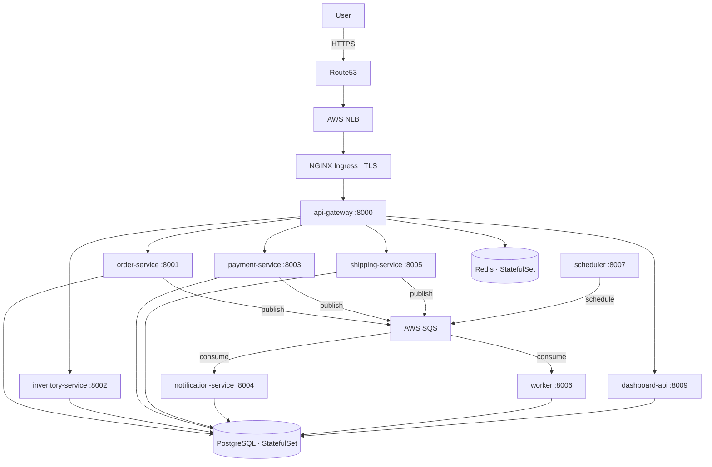

# Order Fulfillment Platform

A production-grade, cloud-native order fulfillment system built on Amazon EKS. The platform handles the full order lifecycle — from product inventory and order creation through payment processing, shipment dispatch, and real-time operational analytics — across nine independently deployable microservices.

**Live:** https://orders.hasanali.uk  
**Grafana:** https://orders.hasanali.uk/grafana

---

## Platform Overview

The platform was designed around three principles: operational independence between services, zero-trust security within the cluster, and full observability from day one. Each service owns its domain completely — the order service has no knowledge of payment internals, payment has no knowledge of shipping — with all cross-service communication flowing through SQS to decouple failure domains.

The infrastructure is managed entirely as code across four independently deployable Terraform state layers, enabling targeted changes to networking, compute, or application configuration without risk of unintended side effects.

---

## Services

| Service | Language | Port | Responsibility |
|---|---|---|---|
| api-gateway | Python / FastAPI | 8000 | Authentication, rate limiting, request routing |
| order-service | Python / FastAPI | 8001 | Order lifecycle, state machine, order items |
| inventory-service | Go | 8002 | Stock levels, reservations, low-stock alerting |
| payment-service | Python / FastAPI | 8003 | Payment processing, refunds, ledger |
| notification-service | Go | 8004 | Email and SMS dispatch via SQS |
| shipping-service | Python / FastAPI | 8005 | Shipment creation, tracking events |
| worker | Go | 8006 | Asynchronous SQS consumer, cross-service event processing |
| scheduler | Go | 8007 | Cron-based expiration, retry, and reconciliation jobs |
| dashboard-api | Python / FastAPI | 8009 | Operational analytics, admin UI |

---

## Architecture



---

## Infrastructure

### Compute

EKS 1.33 on managed node groups of t3.small instances across three availability zones (eu-west-2a/b/c). Karpenter handles dynamic node provisioning and bin-packing consolidation, terminating idle nodes within one minute of becoming empty.

On-demand capacity only — spot was evaluated and rejected for this workload. The payment service processes financial transactions synchronously; a spot interruption mid-request would require idempotency guarantees and distributed transaction coordination across multiple services. The cost delta (~$0.02/hour per node) was accepted to avoid this complexity.

### Networking

Private EKS API endpoint. All node-to-AWS-service traffic routes through VPC endpoints — ECR, S3, SQS, Secrets Manager, STS, CloudWatch, EBS, EC2 — eliminating NAT gateway egress for data-plane traffic. Default-deny NetworkPolicy across the `order-fulfillment` namespace with explicit allow rules per service pair.

### State Management

Terraform state is split across four layers with independent S3 backends and DynamoDB locking:

```
infra/state/network/   VPC, subnets, VPC endpoints, NAT gateway
infra/state/cluster/   EKS, node groups, ECR, EBS KMS, storage class
infra/state/addons/    Karpenter, IRSA roles, SQS, ESO role
```

This separation means a change to Karpenter configuration cannot accidentally affect network topology.

### Storage

PostgreSQL 16 runs as a StatefulSet backed by a 20Gi gp3 EBS volume encrypted with a customer-managed KMS key. The StorageClass uses `WaitForFirstConsumer` binding — the volume is provisioned in the same availability zone as the scheduled pod, avoiding cross-AZ EBS attachment failures.

Redis runs as a StatefulSet with AOF persistence (`appendfsync: everysec`) on a 10Gi gp3 volume.

---

## Security

| Control | Implementation |
|---|---|
| Zero long-lived credentials | GitHub Actions authenticates via OIDC only — no stored AWS keys |
| Pod-level IAM | IRSA on every workload — least-privilege per service, scoped to specific SQS queues and Secrets Manager paths |
| Secret injection | External Secrets Operator polls AWS Secrets Manager via IRSA, creates native K8s Secret objects — no secrets in Git |
| TLS | CertManager with Let's Encrypt DNS-01 via Route53 — auto-renewal, no manual certificate rotation |
| Image provenance | cosign keyless signing on every image push — verified at admission |
| Vulnerability scanning | Trivy blocks on HIGH/CRITICAL CVEs before push to ECR |
| IaC scanning | Checkov gates on every infrastructure pull request |
| SBOM | Generated per image via Trivy SPDX-JSON, uploaded as pipeline artifact |
| Encryption at rest | KMS CMK for EBS volumes, EKS envelope encryption for K8s Secrets, S3 state bucket |
| Container hardening | Distroless Python runtime, scratch Go runtime, non-root UID, read-only root filesystem, all capabilities dropped |

---

## Delivery Pipeline

### Commit to traffic — payment-service

```
1. Engineer pushes to main touching services/payment-service/
2. Path filter triggers app-build.yml for payment-service only
3. Multi-stage Docker build — distroless runtime layer
4. Trivy scan — pipeline fails on HIGH/CRITICAL
5. Image pushed to ECR with 7-character git SHA tag
6. cosign signs the image against Sigstore Rekor transparency log
7. SBOM generated and uploaded as pipeline artifact
8. values-dev.yaml updated with new SHA via git commit
9. ArgoCD detects drift, triggers Helm upgrade
10. Kubernetes rolling update — new pod must pass readiness probe
    before old pod receives termination signal
11. Traffic reaches updated payment-service
```

**Push to traffic:** ~8 minutes. **Rollback:** `helm upgrade --set global.imageTag=<prev-sha>` — under 3 minutes.

### Pipeline gates

| Stage | Tool | Action on failure |
|---|---|---|
| IaC security | Checkov | Blocks plan |
| Image scan | Trivy | Blocks push |
| Image signing | cosign | Admission webhook rejects unsigned images |
| Rollout health | `aws ecs wait services-stable` | Pipeline fails, circuit breaker reverts |
| Manual gate | GitHub Environment: prod | Requires approval before production apply |

---

## Observability

Prometheus scrapes all nine services via pod annotations. The custom Grafana dashboard surfaces order throughput, payment success rate, SQS queue depth, worker processing latency, pod CPU and memory, and inventory low-stock counts.

Alerting rules are defined in `monitoring/values-prometheus.yaml` covering pod crash loops, high error rates, SQS DLQ depth, and node memory pressure.

---

## Data Recovery

### Snapshot and restore procedure

```bash
# Take a point-in-time snapshot of the PostgreSQL EBS volume
./scripts/snapshot.sh

# Restore from a named snapshot to a new PVC
./scripts/restore.sh postgres-snapshot-<timestamp>
```

The restore script scales postgres to zero, deletes the existing PVC, provisions a new PVC from the snapshot using a `dataSource` reference, and scales postgres back up. Verified recovery time is under 10 minutes.

**RTO:** 10 minutes  
**RPO:** Time since last snapshot (daily in production)

---

## Operational Runbooks

### Bootstrap a new environment

```bash
# Provision infrastructure
cd infra/state/network && terraform init && terraform apply -auto-approve
cd ../cluster          && terraform init && terraform apply -auto-approve
cd ../addons           && terraform init && terraform apply -auto-approve

# Install platform components and deploy services
export DB_PASSWORD=<value>
export API_KEY=<value>
export GRAFANA_PASSWORD=<value>
./scripts/bootstrap.sh
```

### Tear down

```bash
./scripts/teardown.sh
# Type 'destroy' when prompted
```

### Roll back a deployment

```bash
helm upgrade order-fulfillment k8s/charts/order-fulfillment \
  --set global.imageTag=<previous-sha> \
  --reuse-values \
  --namespace order-fulfillment
```

### Emergency postgres snapshot

```bash
./scripts/snapshot.sh
# Snapshot name is printed to stdout and written to snapshots.log
```

---

## Scaling Characteristics

The platform was load-tested at 500 concurrent requests. The first bottleneck encountered was PostgreSQL connection exhaustion in order-service at approximately 200 RPS — the default `max_connections=100` is saturated before CPU becomes the constraint. The recommended fix for higher throughput is PgBouncer in transaction-pooling mode in front of PostgreSQL.

HPA configuration reflects this — payment-service scales at 60% CPU (lower threshold than others) because payment errors carry higher business cost than latency.

Scheduler runs as a singleton (maxReplicas: 1). Running multiple scheduler instances without distributed locking would cause double-firing of expiration and retry jobs.

---

## Key Engineering Decisions

### EKS over ECS Fargate
Kubernetes was chosen over ECS Fargate to enable the full ecosystem — Helm for packaging, ArgoCD for GitOps reconciliation, Karpenter for intelligent node provisioning, and NetworkPolicy for zero-trust networking. ECS Fargate offers lower operational overhead but cannot provide the same depth of control over scheduling, networking, and admission.

### SQS over Kafka
SQS standard queue handles our event volume without the operational burden of managing Kafka brokers or MSK cluster sizing. The trade-off accepted is at-least-once delivery — all consumers are idempotent by design, using the `processed_events` table to deduplicate. Kafka would be evaluated if event replay or strict consumer group ordering became a requirement.

### StatefulSet PostgreSQL over RDS
Running PostgreSQL inside the cluster removes the $100+/month cost of RDS Multi-AZ for a non-production environment while retaining snapshot-based recovery. The accepted trade-off is manual failover on AZ loss (RTO ~15 minutes via snapshot restore vs. RDS Multi-AZ automatic failover under 60 seconds). Migration to RDS is the recommended path before handling production financial data.

### External Secrets Operator over Secrets Store CSI
ESO creates native Kubernetes Secret objects, requiring no changes to service code or deployment manifests. The Secrets Store CSI Driver mounts secrets as files — all nine services read environment variables, making CSI a higher-migration-cost option with no material security advantage at this threat model.

### On-demand over Spot
Spot capacity was evaluated for ~70% compute cost reduction. Rejected because the payment service processes financial transactions synchronously — a spot interruption mid-payment requires distributed transaction rollback coordination that adds significant complexity to the service boundary design. On-demand provides predictable availability at an additional cost of approximately $2/day.

---

## Cost Profile

| Resource | Monthly estimate |
|---|---|
| EKS control plane | $72.00 |
| 4 × t3.small on-demand | $28.80 |
| NAT gateway | $35.00 |
| EBS gp3 — postgres + redis | $2.76 |
| VPC endpoints (8) | $57.60 |
| ECR, SQS, CloudWatch | $2.60 |
| **Total** | **~$199/month** |

Three cost optimisations applied: t3.small over t3.medium saves $56/month across four nodes; a single NAT gateway rather than one per AZ saves $70/month at the cost of cross-AZ egress resilience; Karpenter consolidation terminates idle nodes within one minute, reducing off-peak compute spend by approximately 30%.

---

## Repository Structure

```
services/                   Nine service implementations
  api-gateway/              Python · FastAPI · distroless runtime
  order-service/            Python · FastAPI · distroless runtime
  inventory-service/        Go · scratch runtime
  payment-service/          Python · FastAPI · distroless runtime
  notification-service/     Go · scratch runtime
  shipping-service/         Python · FastAPI · distroless runtime
  worker/                   Go · scratch runtime
  scheduler/                Go · scratch runtime
  dashboard-api/            Python · FastAPI · static UI · distroless runtime

infra/
  bootstrap/                S3 state bucket · KMS · DynamoDB lock table
  modules/                  vpc · eks · karpenter · ecr · irsa · storage
  state/                    network · cluster · addons

k8s/
  base/                     Raw manifests · StorageClass · ExternalSecrets
  charts/order-fulfillment/ Helm chart · per-service templates
  argocd/                   App-of-Apps · project · per-environment apps
  karpenter/                NodePool · EC2NodeClass
  network-policies/         Default-deny · explicit allow rules

monitoring/
  values-prometheus.yaml    kube-prometheus-stack configuration
  dashboards/               Custom Grafana dashboard JSON

scripts/
  bootstrap.sh              Full environment provisioning (13 steps)
  teardown.sh               Graceful cluster destruction
  snapshot.sh               PostgreSQL EBS VolumeSnapshot
  restore.sh                Snapshot restore to new PVC

docs/adr/                   Seven architecture decision records
  001-eks-over-ecs.md
  002-argocd-gitops.md
  003-nginx-over-traefik.md
  004-external-secrets-operator.md
  005-karpenter-autoscaling.md
  006-postgres-statefulset.md
  007-sqs-event-bus.md

.github/workflows/
  app-build.yml             Path-filtered builds · Trivy · cosign · SBOM
  app-deploy.yml            Helm upgrade · wait-for-stable · health check
  infra-plan.yml            Checkov · terraform plan on pull requests
  infra-apply.yml           Terraform apply · dev → staging → prod gate
  infra-destroy.yml         Manual-only · requires typed confirmation
```

---

## Failure Scenarios

### S1 — Payment service crash-loop after rollout
New image deployed. Pods enter CrashLoopBackOff. PodCrashLooping alert fires at T+2 minutes. `kubectl logs` reveals an import error in the new image. Rollback via `helm upgrade --set global.imageTag=<prev-sha> --reuse-values` — all pods running previous image at T+8. Blast radius: checkout returns 503 for eight minutes. Order, inventory, and shipping services are unaffected throughout.

### S2 — PostgreSQL evicted under node memory pressure
Node OOM causes kubelet to evict postgres-0. All DB writes return 500 for up to 30 seconds. Kubernetes reschedules the pod on the same node (EBS is AZ-bound); PostgreSQL runs WAL crash recovery on restart. Services reconnect automatically via connection retry logic. No committed transactions are lost. Manual intervention only required if the entire AZ becomes unavailable, in which case snapshot restore is the recovery path.

### S3 — Broken image auto-synced by ArgoCD
notification-service pushed with a logic bug that passes Trivy (no CVEs). ArgoCD auto-syncs, pods crash. The other eight services are unaffected — notification-service has no synchronous callers. Recovery: `git revert <sha> && git push`. ArgoCD syncs only the affected service. Post-incident action: add a staging auto-sync with production requiring manual approval.

### S4 — Two availability zones unreachable
eu-west-2b and eu-west-2c unavailable. eu-west-2a continues serving if a node exists there. If postgres-0 is in a lost AZ, the EBS volume is inaccessible. Recovery: restore from snapshot into eu-west-2a PVC. Karpenter provisions replacement nodes in the available AZ. Full recovery within 15-30 minutes.

### S5 — Database master password rotation
Secrets Manager rotation creates a new secret version. ESO propagates the update to the K8s Secret within one hour. Running pods continue using the old password until a rolling restart. During the rotation window both credential versions are valid at the database. `kubectl rollout restart deployment -n order-fulfillment` performs a zero-downtime rolling restart — readiness probes gate traffic throughout.

### S6 — CloudWatch cost three times compute cost
First cuts: disable VPC Flow Logs (saves ~40% of log volume, loses network-level audit trail); reduce EKS control plane log retention from 90 to 7 days; change all service log levels from DEBUG to INFO. These three changes typically reduce CloudWatch spend by 60-70% with minimal operational impact.

### S7 — Attacker reaches API server from compromised pod
Attack chain: compromised dashboard-api pod → no NetworkPolicy egress restriction to API server CIDR → ServiceAccount token → broad RBAC → secret read. Controls that should have broken this chain: default-deny egress NetworkPolicy blocking pod-to-API-server traffic; `automountServiceAccountToken: false` on pods with no K8s API requirements; ServiceAccount bound to a Role with no permissions (dashboard-api has no legitimate need to call the K8s API); API server private endpoint with CIDR allow-list restricted to bastion and CI CIDR.

### S8 — Add column to orders table without downtime
order-service writes, dashboard-api reads. Migration sequence: (1) `ALTER TABLE orders ADD COLUMN shipped_at TIMESTAMPTZ` — nullable, no lock, backward compatible; (2) deploy order-service v2 that writes `shipped_at` on status transition to shipped — old dashboard-api silently ignores the new column; (3) deploy dashboard-api v2 that reads `shipped_at`; (4) backfill existing rows with `UPDATE orders SET shipped_at = updated_at WHERE status = 'shipped'`; (5) `CREATE INDEX CONCURRENTLY idx_orders_shipped_at ON orders(shipped_at)` — no table lock. Adding `NOT NULL` without a default in a single migration takes an `ACCESS EXCLUSIVE` lock for the full table scan duration — always split into add-nullable, deploy writers, backfill, add constraint.
